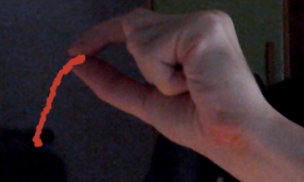
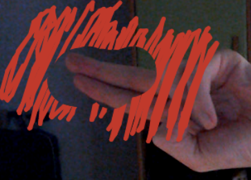
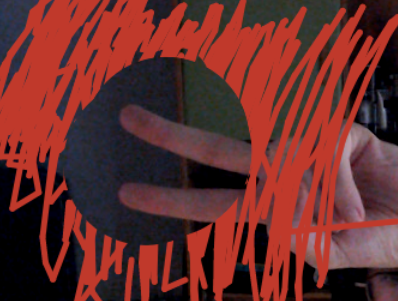

# One link videochat
This is a small video chat application that allows you to keep a peer-to-peer secure conversation with anyone by sharing only one link, without the need of installing any application or creating an account.

## Motivation
Tired of bad quality and high latency video chats, installing applications that constantly crash, and having the need of creating accounts in different services (depending on the person you are talking to), I decided to create a video chat to connect two persons with only one simple link.

## How it works
The video chat uses WebRTC as the communication protocol allowing a low latency, secure and direct connection between users who have a non-address dependant NAT at their home (Almost everyone). For those who have an address-dependent NAT, the video chat relies on a self-hosted TURN server or the TURN servers provided by the [openrelay project](https://www.metered.ca/tools/openrelay/).

### Connection process
1. A link is generated with the yellow button of the person with a + symbol. Once the button is pressed a UUID (Unique identifier) is created that is going to be used to identify a WebSocket connection that will be established against a small server written in RUST.
2. The created link, which contains the UUID previously created, is shared with another person. When the link is accessed, another videochat client is opened that automatically will use the UUID inserted in the link to create another Websocket connection against the server. 
3. Once the second WebSocket connection is established, the server realizes that there was another WebSocket connection with the same UUID and it creates communication between both WebSockets, sending a message to the first one notifying about this fact.
4. The client that has generated the UUID then will create a WebRTC offer and make a request to a STUN server to get the information about which ports and IPs the other user could potentially connect to (ICE Candidates). Once the information is obtained it is sent through WebSocket to the other client.
5. The second client gets and processes the information from the first one and creates an answer based on that. This client then requests the STUN server and the answer information together with candidates are sent back using the WebSocket connection to the first client.
6. The first client process the information from the second one and the WebRTC connection is established.

## Features

- :white_check_mark: Automatic reconnection on browser refresh. If you refresh the browser during a video call, automatically reconnects to the call.
- :white_check_mark: Screen sharing.
- :white_check_mark: Text chat inside the videochat.
- :white_check_mark: Mobile devices support.
- :white_check_mark: Optional connection without a server.
- :white_check_mark: Change video or audio sources during the calls.
- :white_check_mark: Draw using your hands. You have the pencil option that will allow you to write over the screen using your fingers. A tensorflow model is used to recognize your hands whilst other models were trained to recognize the gesture to write/erase the painted content.
- :white_check_mark: The Videochat aims to send video at 1080 at 60 fps prioritizing fluency over quality.
- :white_check_mark: Audio stream optimized for speech with echo/noise canceling.

### Work in progress
- :construction: **Multiuser videocalls**. A solution is being designed to support decentralized multiuser video calls up to 20 participants. The solution involves on relaying connections and creating a load balancing system to redistribute the load amongst participants depending on their resources, connection, NAT type...
- :construction: **Changing drawing properties**. Create an interface to change the color, thickness... of the drawing feature by using your non-drawer hand.
- :construction: **Configuration parameters**. Add to the interface configuration parameters to control the video and audio sent.

- :construction: **Improve chat characteristics**. Adding characteristics like emojis to the text chat included in the videochat.

## How to use

### Buttons behavior
This section describes the behavior of the buttons which are organized by their position in the screen.
#### Bottom left
Button            |  Description
:-------------------------:|:-------------------------
 |Introduce the ID of the room to connect to. It can be used to create a new room with a specific ID.
 |Generate the link that you can share with another user to create a videocall with you.

#### Top left
Button            |  Description
:-------------------------:|:-------------------------
 |Settings dial: This button will show the action buttons below.
 |Settings: From this sections you will be able to modify settings such as the video/audio sources.
 |Info: Open the information window you are watching right now.
 |Resize: Set the remote video in full screen mode.
 |Drawing: Activates the drawing mode, loading a tensorflow model and starting hands detection.
 |Serverless: Avoid using the signaling server by inserting yourself the offer/answer.
 |Exit: Go to the main webpage.

#### Bottom center
Button            |  Description
:-------------------------:|:-------------------------
 |Screen share: Enable/Disable screen/window sharing.
 |Microphone enabled. Mute or unmute your microphone.
 |Video enabled: Enable/Disable camera.
 |Hang up

#### Top right
Button            |  Description
:-------------------------:|:-------------------------
 |Open the chat.

### Drawing feature
You can draw in the video chat to explain things to your peer or just to have fun. 
> For having a good experience with this feature is recommended to have a camera that is able to get 60 images per second together with a computer able to estimate hands position in a rate equals or superior to your camera speed. 

#### Draw
You can draw by putting your index fingertip and thumb together as shown in the image below. By separating them you stop writing.
 

#### Erase
You can erase the content you draw with this utility by doing the gesture shown below.
 

You can also increase the erasing radius by separating your fingers:
 